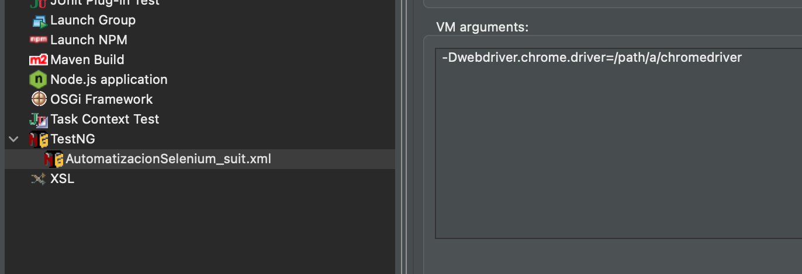
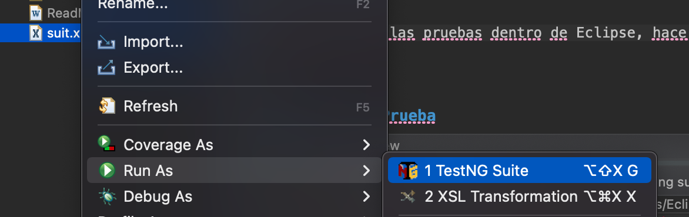
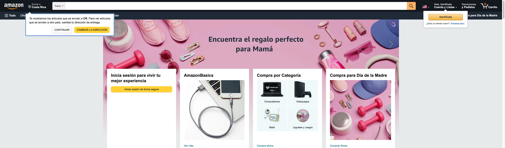
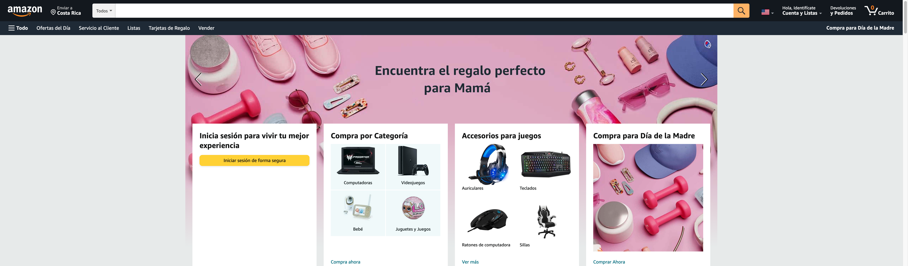

# Ejemplo Automatización de Pruebas Funcionales

* Curso: PSWE-06 Calidad y Pruebas de Software SC54
* Profesor: Leonardo Zeledón Vargas
* Estudiante: Jose Alberto Aguilar Romero

## Descripción del código

### Clases importantes

* Adaptador.Driver: Clase Singleton que funciona como *Wrapper* a la clase *WebDriver* de Selenium, usada para interactuar con la página y el navegador.
* Paginas.AmazonLogin y Paginas.AmazonPrincipal: Contiene los métodos para interactuar con las páginas de login y la página principal de Amazon.com
* CasosDePrueba.CasosAmazonLogin y CasosDePrueba.CasosAmazonPrincipal: Contiene los casos de prueba detallados en la seccion [Casos de Prueba](#casos-de-prueba)

### Configuración de la aplicación

La configuración de la aplicación se hace a través de un Test Suite de TestNG, en el archivo suit.xml. Los principales parámetros son:

* navegador: Describe el nombre del navegador a usar y que esté configurado en el sistema. En este caso **SOLAMENTE SE VALIDÓ EN EL NAVEGADOR  Chrome**.
* url: URL de la página de login de Amazon.com
* urlPrincipal: URL de la página principal de Amazon.com.
* folderEvidencia: Folder en el almacenamiento local donde se guardan los pantallazos tomados durante la ejecución de las pruebas. **DEBE IR SIN EL `/` FINAL**. A este nombre se le agrega como sufijo el *timestamp* de la corrida.
* usuarioInvalido: Usuario que provoca un error al tratar de ingresar a Amazon

### Configuración de Selenium

Para poder ejecutar la aplicación, es necesario tener instalado el driver de Chrome en algún lugar del sistema, así como Chrome.
Se puede definir la propiedad de Java `webdriver.chrome.driver`, o de lo contrario la aplicación va a buscar el archivo `chromedriver` (Driver de Chrome en macOS) en el directorio actual (`.`). La versión del webdriver debe ser compatible con la versión del navegador.

Para pasar la propiedad de Java en la línea de comando se puede utilizar:

```
java -Dwebdriver.chrome.driver=<localización del driver>
```
O configurarlo en Eclipse dentro de las opciones de `Run Configuration...`:



### Ejecución

Para ejecutar las pruebas dentro de Eclipse, hacer click derecho sobre el archivo suit.xml y seleccionar `Run As...` y después `TestNG Suite`:




## Casos de Prueba

Los siguientes dos casos de prueba fueron automatizados:

### Test Case 002

* Test Case Id: TC002
* Test Case Description: Caso de Prueba de login no exitoso
* Version 1.0

**Test Scenario**: Verificar el funcionamiento de un login con un usuario inválido

| Step # | Step Details                   | Expected Results                          | Actual Results | Pass/Fail/Not Executed/Suspended |
|--------|--------------------------------|-------------------------------------------|----------------|----------------------------------|
| 1      | Abrir la Url de Amazon         | El sistema debe de ser cargado            |                |   Pass                               |
| 2      | Click en el boton Identificate | El sistema muestra el formulario de login |                |  Pass                                |
| 3      | Ingresar Usuario  | Las credenciales son ingresadas          |                |Pass |
| 4      | Click en boton de ingresar     | Login realizado sin exito                 |  |  Pass                                |

### Test Case 005

* Test Case Id: TC005
* Test Case Description: Caso de Prueba de Cambio de Idioma de la pagina
* Version 1.0

**Test Scenario**: Verificar el funcionamiento de un login con un usuario inválido

| Step # | Step Details                   | Expected Results                          | Actual Results | Pass/Fail/Not Executed/Suspended |
|--------|--------------------------------|-------------------------------------------|----------------|----------------------------------|
| 1      | Abrir la Url de Amazon         | El sistema debe de ser cargado            |                | Pass                                 |
| 2      | Click en el boton de la bandera | El sistema muestra el formulario de cambiar idioma |Formulario mostrado               | Pass                                 |
| 3      | Seleccionar Español  | El sistema selecciona el idioma español          |  Idioma Seleccionado              |                             Pass     |
| 4      | Click en boton de "Guardar Cambios"     | El sistema guarda los cambios y retorna a la página principal |  Regresa a la pagina principal             |       Pass                           |
| 5      | Revisar el idioma sea español  | Se revisa una palabra en español del sitio          |                 | Pass                                 |


## Resultado de la ejecución

```
[RemoteTestNG] detected TestNG version 7.5.0
[main] INFO org.testng.internal.Utils - [TestNG] Running:
 ./AutomatizacionSelenium/suit.xml

Starting ChromeDriver 101.0.4951.41 (93c720db8323b3ec10d056025ab95c23a31997c9-refs/branch-heads/4951@{#904}) on port 59365
Only local connections are allowed.
Please see https://chromedriver.chromium.org/security-considerations for suggestions on keeping ChromeDriver safe.
ChromeDriver was started successfully.
May 01, 2022 4:18:48 PM org.openqa.selenium.remote.ProtocolHandshake createSession
INFO: Detected dialect: W3C
May 01, 2022 4:18:49 PM org.openqa.selenium.devtools.CdpVersionFinder findNearestMatch
WARNING: Unable to find an exact match for CDP version 101, so returning the closest version found: 97
May 01, 2022 4:18:49 PM org.openqa.selenium.devtools.CdpVersionFinder findNearestMatch
INFO: Found CDP implementation for version 101 of 97

===============================================
Suite de Prueba
Total tests run: 2, Passes: 2, Failures: 0, Skips: 0
Configuration Failures: 1, Skips: 0
===============================================


```
